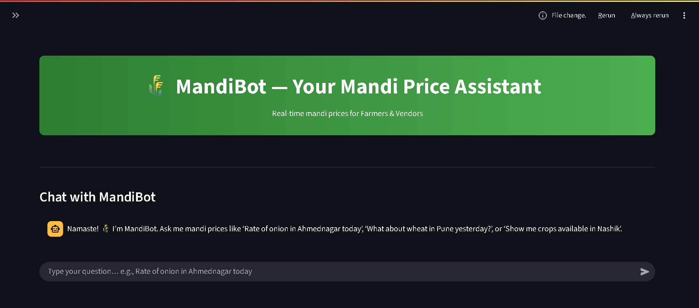

# 🌾 MandiBot — Your Mandi Price Assistant

MandiBot is a Streamlit-based chatbot designed specifically for farmers and vendors to check today's mandi (market) rates for various crops across India.

## Features

- **Today & Yesterday Prices**: Get both current and previous day's crop prices
- **Price Trend Analysis**: Compare prices with visual trend indicators
- **Role-based Interface**: Separate interfaces for farmers and vendors
- **Smart Search**: Natural language queries with fuzzy matching
- **State/Market Filtering**: Optional location-based filtering
- **Caching**: 1-hour cache for improved performance
- **Beautiful UI**: Green-themed interface with agricultural branding
- **Mobile Friendly**: Responsive design that works on all devices

## Screenshot


## Installation

1. **Install Python Dependencies**:
   ```bash
   pip install -r requirements.txt
   ```

2. **Run the Application**:
   ```bash
   streamlit run app.py
   ```

3. **Open in Browser**:
   The app will automatically open in your default browser at `http://localhost:8501`

## How to Use

1. **Select Your Role**: Choose between Farmer 👨‍🌾 or Vendor 🏬
2. **Natural Language Query**: Type queries like "Rate of onions in Pune today" or "Tomato prices"
3. **Smart Suggestions**: Get crop suggestions as you type
4. **Get Results**: Click "Get Today's & Yesterday's Rates" to fetch price comparison
5. **View Trends**: See price changes with visual trend indicators

## Data Source

This application uses the official Government of India Open Data Platform:
- **API**: data.gov.in mandi price dataset
- **Resource ID**: 9ef84268-d588-465a-a308-a864a43d0070
- **Update Frequency**: Daily
- **Coverage**: Pan-India mandi prices

## Sample Crops

You can search for popular crops like:
- **Vegetables**: Tomato, Onion, Potato, Cauliflower, Cabbage
- **Cereals**: Wheat, Rice, Maize, Jowar, Bajra
- **Pulses**: Tur, Gram, Moong, Urad
- **Spices**: Turmeric, Coriander, Cumin, Chilli
- **Cash Crops**: Cotton, Sugarcane, Groundnut, Soybean

## Features

### For Farmers 👨‍🌾
- Check current market rates before selling
- Compare prices across different markets
- Plan crop sales strategically

### For Vendors 🏬
- Monitor wholesale prices
- Track market trends
- Make informed purchasing decisions

## Technical Details

- **Framework**: Streamlit
- **Data Caching**: 1-hour TTL for API responses
- **API Timeout**: 10 seconds
- **Error Handling**: Comprehensive error messages for various scenarios
- **Responsive Design**: Works on desktop and mobile devices

## Troubleshooting

**No data found for today?**
- Markets might be closed
- No arrivals recorded for the crop
- Try different spelling of crop name
- Check again later in the day

**API errors?**
- Check internet connection
- Government API might be temporarily down
- Try again after a few minutes

## Contributing

This application is built for India's agricultural community. Feel free to suggest improvements or report issues.

---

**Made with ❤️ for India's Agriculture**

## Deployment

You can deploy this app to GitHub and Streamlit Community Cloud (free) quickly. Below are the recommended steps.

1. Create a Git repository and push

```powershell
git init
git add .
git commit -m "Initial commit - MandiBot"
# Create a repository on GitHub, then push (replace <remote-url>)
git remote add origin <remote-url>
git branch -M main
git push -u origin main
```

2. Enable GitHub Actions (CI)

The repo contains a sample GitHub Actions workflow at `.github/workflows/python-app.yml` that installs dependencies and runs `test_api.py` on push.

3. Deploy to Streamlit Community Cloud

- Go to https://share.streamlit.io and sign in with GitHub.
- Click "New app" and select your repository and branch (`main`).
- Set the main file to `app.py` and the Python version to 3.12 if prompted.
- Click "Deploy". Streamlit will install packages from `requirements.txt`.

Notes:
- Keep any secrets (API keys) out of the repo. Use Streamlit's Secrets manager (`.streamlit/secrets.toml` locally — do NOT commit it). In Streamlit Cloud, set secrets via the app settings.
- If Streamlit fails to install `sentence-transformers` or `tensorflow` due to heavy dependencies, consider using a lighter embedding approach or hosting a separate embeddings microservice.

4. Alternative: Deploy to Heroku / Railway / Render

The included `Procfile` and `runtime.txt` make it compatible with Heroku-like PaaS. Streamlit Community Cloud is the most straightforward option for quick demos.

That's it — once connected, your app will auto-deploy on pushes to the configured branch.
